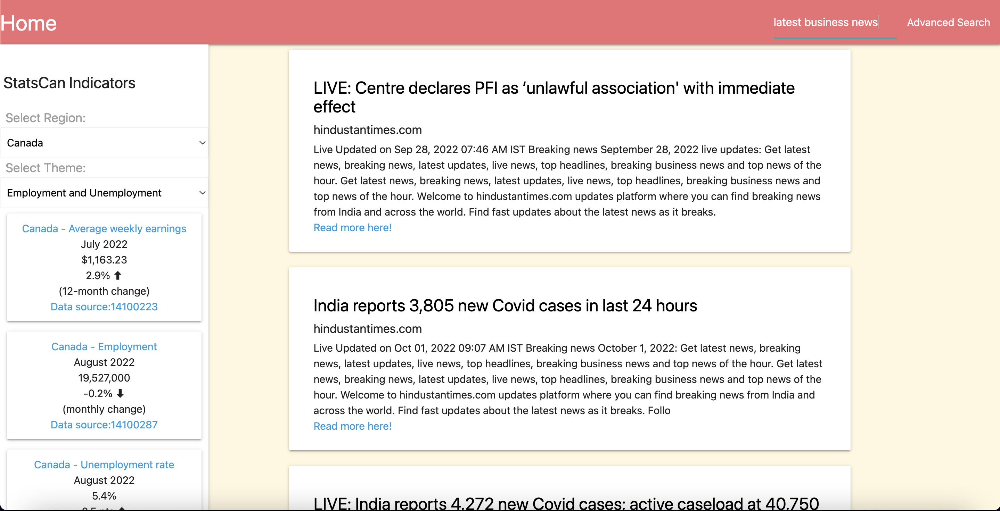
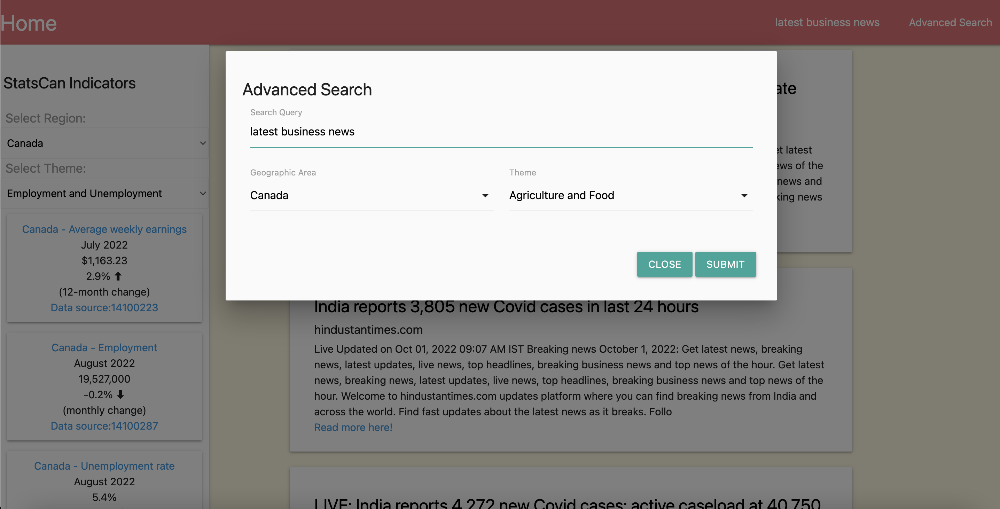

# News Headlines Aggregator

## Description

Develop an interactive news headline aggregator web applicaiton where the user can search for and select topics and aggregate news headlines across multiple news sources as per the requirements stated in the User Story.

The initial development and enhancements will be divided across multiple phase MVPs.

## How to use

There are several ways for the user to interact with the application:

1. Basic News Search

- The user can seach for news headlines across all available news sources by entering text in the search bar in the navbar on top of the page
- Results are displayed in the main page area and the user can view the original news source by clicking on the headline or read-more links.

2. Advanced News Search

- The user can seach for news headlines across all available news sources by clicking on the Advanced Search link in the navbar at top of the page, and then entering text in the search bar while selecting the StatsCan based region and themes which are then added to the news headline search query.
- The resulting news headline search results are displayed in the main page area while the selected StatsCan indicators are displayed in the side navbar.

3. StatsCan Indicators Selection

- The StatsCan indicators are displayed in the side navbar and can be filtered either by selecting a region or theme from the dropdown list, or by using the Advanced Search function as described above which will related the selected StatsCan indicators to the news headline search results displayed in the main area.

## Development Requirements

### User Story - initial MVP

```
AS A news consumer,
I WANT to be able to view business and economic news headlines from at least two news sources
SO THAT I stay informed on business and economic news headlines.
```
### Acceptance Criteria - initial MVP

```
GIVEN a home page that allows me to search the news sources or StatsCan economic indicators
WHEN I enter a basic search query
THEN I am presented with news headlines along with a summary of content preview
WHEN I click on the news source
THEN the original news source is displayed on another browser tab/window
WHEN I search for StatsCan news by region and theme
THEN there is a list of StatsCan key economic indicators displayed for a specific region and theme
WHEN I select a different region or theme from the dropdown boxes
THEN the indicators are updated as per the new selections
WHEN I click on a particular indicator display
THEN the original StasCan news and data sources are displayed on another browser tab/window
WHEN I select the Advanced Search feature in the navigation bar
THEN a modal dialog appears and I can enter a search string along with related StatsCan region and theme dropdown lists
WHEN I used Advanced Search to search for news headlines AND while selecting StatsCan region and them
THEN news headlines search will include the search query as well as the region and theme selections in the StatsCan side navbar
```
### Technologies Utilized

APIs:

1. free-news.p.rapidapi.com (limited to only 21 calls/hour)
2. statcan-economic-indicators-statcan-apicast-production.api.canada.ca

Third-party libraries & CSS Frameworks:
1. Materialize CSS
2. JQuery

Web API:
1. client-side local storage

### Screenshots

Landing page with basic news search and StatsCan indicators displayed in side navbar:



Advanced search modal dialog displayed with search field and region/theme dropdowns:



## Deployment

### GitHub

https://github.com/Honsumal/news-headline-aggregator

### URL

https://honsumal.github.io/news-headline-aggregator/


